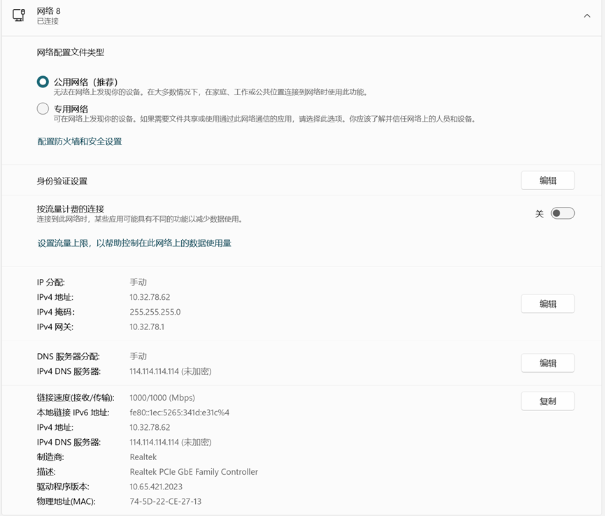

### 实验室接网线用法：

IPv4地址的最后一位不要一样  
***
### 打印机使用方法：
电脑连接打印机的USB线即可。打印机支持无线传输，需要提前连接打印机的WIFI。WIFI密码可以在打印机中打印出来。
***
### 自费物品：
> 如果自己想要买设备留在实验室，请留下单号和对应商铺在设备上，以便设备损坏后去维修。

[M6D充电器，单号：2572189035727916071](https://item.taobao.com/item.htm?app=chrome&bxsign=scdrpplkG5927QzNp4mlWw3nYs1XnyRwj4bLBVsxVNuBe7v4ukxv9EUIjsjsGAqEH-N6v_r_sptQ-rCegItV8phQE1QmToExFXPY__vRZDjx1BWz9Z8UIMTr8tRUG6MhJIQYIno9rD5rEUUaSo2twaBwg&cpp=1&id=656159473309&price=323.52&shareUniqueId=33038941287&share_crt_v=1&shareurl=true&short_name=h.SZbBHbBnjVx1Lmh&sourceType=item&sp_tk=M2FTTDRKUXN4NWg%3D&spm=a2159r.13376460.0.0&suid=0f9f8a19-174f-4fe3-a637-0d13f4ee0115&tbSocialPopKey=shareItem&tk=3aSL4JQsx5h&un=50367853eb3916826ad1af59ef184a00&un_site=0&ut_sk=1.ZOJnpPXl%2BMwDAHGYLZT8UDEI_21646297_1757337823582.Copy.1&wxsign=tbwqo6p426UyZozeNP-JznkDWJ6f_A2Nd2TzqeNY-vpSSykwZNZ3gjZUAOVwuPUxULZpyoSJcpKMz7RrjXSL_S9tELuBzP9guDPkLtnVrgRVk5jtPamJ7JVhqK4y3hSQ7IUR_Pi0xexNfSTLE9_s3HYTw "店名：新动模型")  

[邦远加热台，单号：250501-505078126100891](https://mobile.yangkeduo.com/goods2.html?ps=syevgHMQOp)

***
### 申请物品

[御航芯电池](https://e.tb.cn/h.S1IwKt6uQ38OWIC?tk=TVWu4tUejMP "店名：御航芯旗舰店")  
__注意！如果电池长时间不使用请用充电器设置成store每个月充一次__

